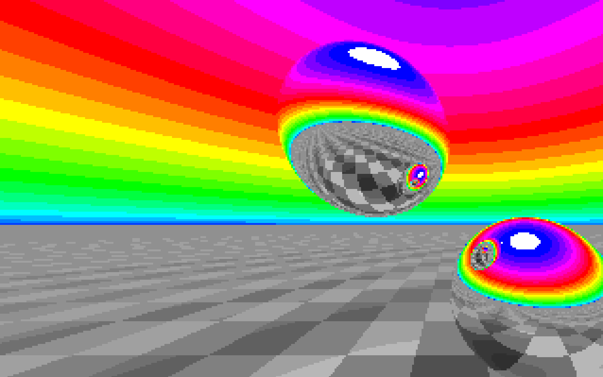

# Ray Tracer in a boot sector

*by Oscar Toledo G. Apr/12/2024*

http://nanochess.org

https://github.com/nanochess

### What is this?

This is a port of the amazing Ray Tracer in Atari 8-bit BASIC by D. Scott Williamson. You can see it at [https://bunsen.itch.io/raytrace-movie-atari-8bit-by-d-scott-williamson](https://bunsen.itch.io/raytrace-movie-atari-8bit-by-d-scott-williamson)

This was based on a static BBC micro version by [@coprolite9000](https://mastodon.social/@coprolite9000@mastodon.me.uk) (see [https://bbcmic.ro/?t=9ctpk](https://bbcmic.ro/?t=9ctpk)) that was based on [@kweepa](https://twitter.com/Kweepa)'s original one (see [whole X thread](https://x.com/bbcmicrobot/status/1322988586828849152)), however at this point it looks like the program cannot be decoded back.

I asked Williamson for permission to make a port to a boot sector, and here it is. I was running around 590 bytes until I found a duplicated calculation that could be made into a subroutine. The code isn't exactly the same because I changed some constants to adapt it, and also collapsed some to save bytes. Anyway, I'm pretty happy I finally found good use for the VGA palette!

If you are going to run it in real hardware it requires a minimum of a Pentium Pro, otherwise most modern emulators will be able to run it.

One of the biggest surprises is how so fast are modern computers so technically the animation is real-time in my Macbook Air running the ray tracer in Windows XP under VirtualBox. You can see it on [Youtube](https://www.youtube.com/watch?v=AZdzECF2Huw).

### How to use it.

If you want to assemble it, you must download the Netwide Assembler (NASM) from www.nasm.us

Use this command line:

    nasm -f bin ray.asm -Dcom_file=1 -o ray.com
    nasm -f bin ray.asm -Dcom_file=0 -o ray.img

Tested with VirtualBox for macOS running Windows XP and also executing directly the bootsector. It probably works with QEMU:

    qemu-system-x86_64 -fda ray.img

Because DOSBox-X runs very slowly, I further tested with VirtualBox over Windows 11 (Asus TUF F17), created a Windows XP 32-bit machine (you don't need to install Windows nor a hard disk image), in Configuration/Storage in the bottom there is a icon saying "Add controller", choose I82078 (floppy), then click "Add floppy drive", and select the boot sector as image (ray.img).

## Acknowledgments

Thanks to Peter Ferrie for helping me to save 23 bytes (my original program was 506 bytes, now it is 483 bytes).

## More on this?

Do you want to learn 8086/8088 assembler? Get my books Programming Boot Sector Games containing an 8086/8088 crash course! Also available More Boot Sector Games. Now available from Lulu and Amazon!
